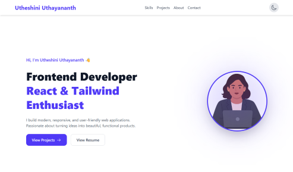
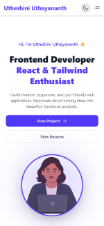

# 🌐 My Portfolio

This is my personal portfolio website built with React.js and Tailwind CSS. It showcases my skills, projects, and experience as a Frontend Developer.

---
## 🔗 Live Demo

👉 [Visit my Portfolio](https://utheshini.vercel.app/)

---

## 🚀 Features

- Responsive and mobile-friendly design
- Modern UI with clean layout
- Project showcase with live demos & GitHub links
- Viewable resume option
- Contact links for easy reach

---

## 🛠️ Tech Stack

- **Frontend:** React.js, Tailwind CSS
- **Build Tool:** Vite
- **Deployment:** Vercel
- **Version Control:** Git & GitHub

---

## 📂 Sections

- Home / Hero – Introduction with resume link
- Skills – Tools and technologies I use
- Projects – Featured projects with links
- About Me – Short bio
- Contact – Get in touch

---

## 📸 Screenshots

### Desktop View

### Mobile View

---

## 📄 License

This project is licensed under the MIT License..

---

## 🙋‍♀️ About Me

I’m a recent graduate and aspiring Frontend Developer passionate about building real-world projects. This portfolio showcases my skills in 
**React.js**, **Tailwind CSS**, and modern web development as I continue improving my UI and React expertise.  

---

## 📬 Contact 

- **Email:** utheshini10@gmail.com  
- **LinkedIn:** [LinkedIn](https://linkedin.com/in/utheshini-uthayananth)  
- **GitHub:**  [GitHub](https://github.com/utheshini)  

---

✨ Thanks for checking out my portfolio! Feel free to connect with me on LinkedIn
 